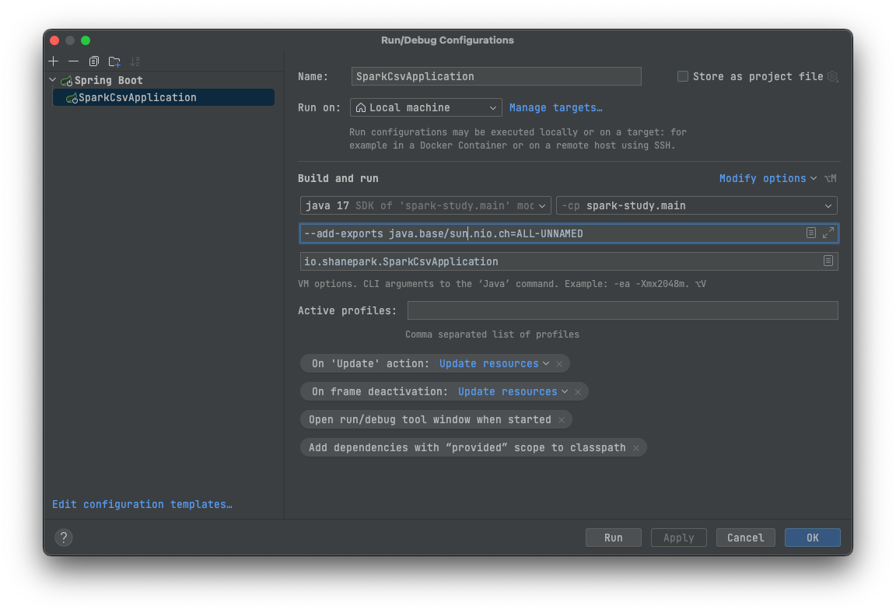

# Spark Study Project

## Overview

This repository serves as a sandbox for testing and studying Apache Spark functionalities. The intent is to understand
and master various features and capabilities of Apache Spark for a new company project. The project contains practical
examples that demonstrate fundamental tasks like reading CSV files and converting them to Parquet format.

## Pre-requisites

- Java 1.8 or higher
- Apache Spark 3.4.1
- Gradle

##        

When you use java 17+ you will get the following error:

```
cannot access class sun.nio.ch.DirectBuffer (in module java.base) because module java.base does not export sun.nio.ch to unnamed module
```

in this case, you should add vm option `--add-exports java.base/sun.nio.ch=ALL-UNNAMED"` to your run configuration.
for example, in IntelliJ Idea, you can add this option to the `VM options` field in the `Run/Debug Configurations`
dialog.


